***

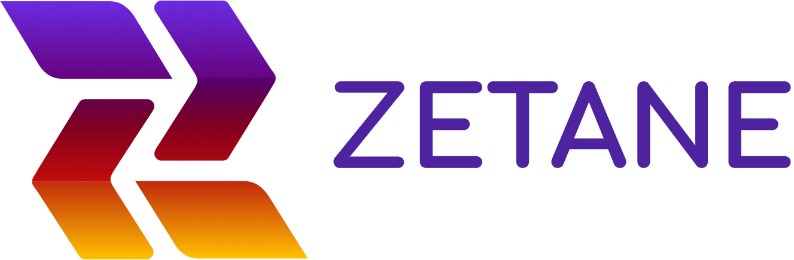
  

The __free Zetane Viewer__ is a tool to help understand and accelerate discovery in machine learning and artificial neural networks. It can be used to open the AI black box by visualizing and understanding the model's architecture and internal data (feature maps, weights, biases and layers output tensors). It can be thought of as a tool to do neuroimaging or brain imaging for artificial neural networks and machine learning algorithms.

 You can also launch your own Zetane workspace directly from your existing scripts or notebooks via a few commands using the Pro version (see Zetane Pro section below).
  

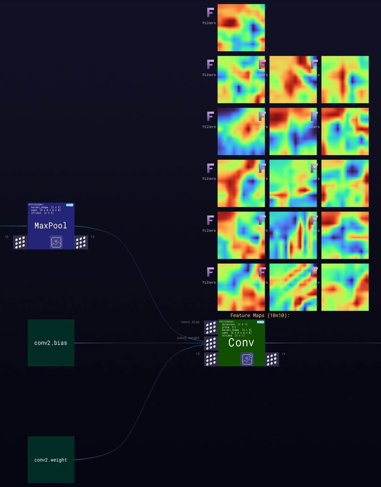
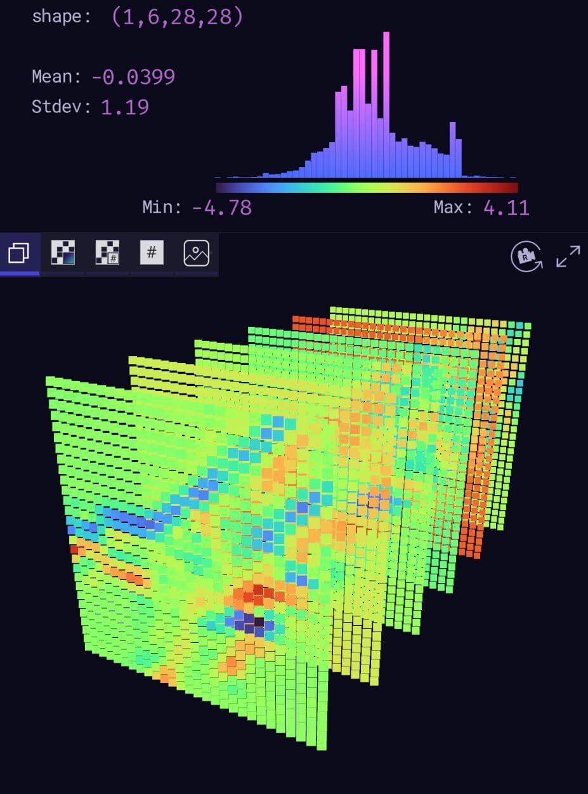

***

# **Zetane Viewer**

## Installation
You can install the __free__ Zetane viewer for Windows, Linux and Mac, and explore ZTN and ONNX files.

[Download for Windows](https://download.zetane.com/zetane/Zetane-1.1.3.msi)

[Download for Linux](https://download.zetane.com/zetane/Zetane-1.1.3.deb)

[Download for Mac](https://download.zetane.com/zetane/Zetane-1.1.3.dmg)

## Tutorial
In this [video](https://www.youtube.com/watch?v=J3Zd5GR_lQs&feature=youtu.be), we will show you how to load a Zetane or ONNX model, navigate the model and view different tensors:

Below is the step-by-step instruction of how to load and inspect a model in the Zetane viewer:
- ### How to load a model
The viewer supports both .ONNX and .ZTN files. The ZTN files were generated from the Keras and Pytorch scripts shared in this Git repository. After launching the viewer, to load a Zetane model, simply click “Load Zetane Model” in the DATA I/O menu. To load an Onnx model, click on “Import ONNX Model” in the same menu. Below you can access the ZTN files for a few models to load. You can also access ONNX files from the [ONNX Model Zoo](https://github.com/onnx/models).
  
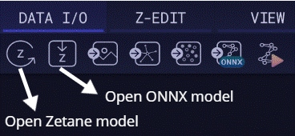

When a model is displayed in the Zetane engine, any components of the model can be accessed in a few clicks.

At the highest level, we have the model architecture which is composed of interconnected nodes and tensors. Each node represents an operator of the computational graph. Usually, an input tensor is passed to the model and as it goes through the nodes it will be transformed into intermediate tensors until we reach the output tensor of the model. In the Zetane engine, the data flows from left to right.
  
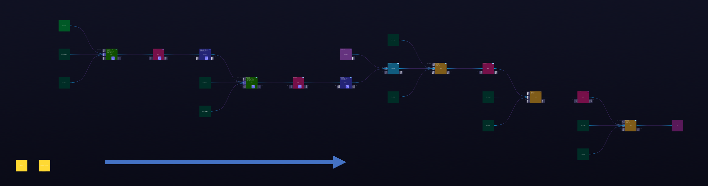

- ### How to navigate
You may navigate the model, from left to right and up to down and vice versa. [Here](https://docs.zetane.com/interactions.html#) is the complete list of navigation instructions.
- ### How to inspect different layers and feature maps
For each layer, you have the option to view all the feature maps and filters by clicking on the “Show Feature Maps” on each node. You may inspect the inputs and outputs and weights and biases using the tensor view bar.
  

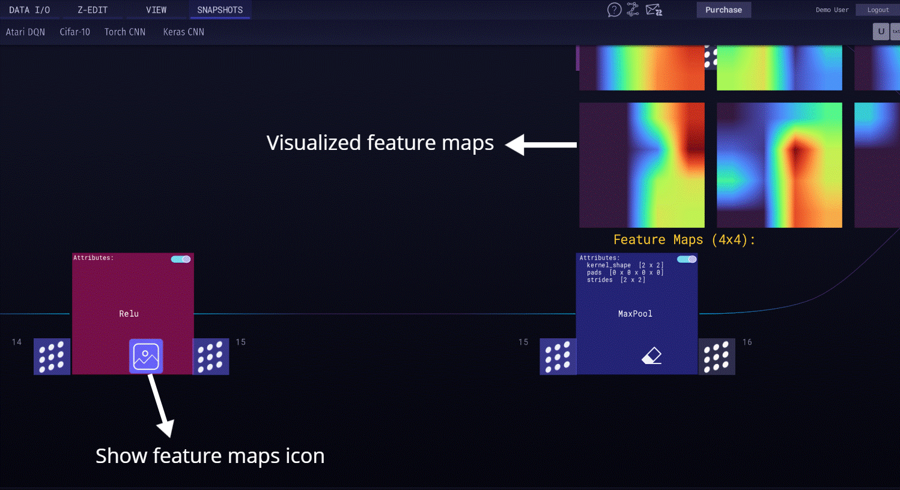

- ### Tensor view bar
By clicking on the associated button, you can visualize inputs, outputs, weights and biases (if applicable) for each individual layer. You can also investigate the shape, type, mean and standard deviation of each tensor.
  

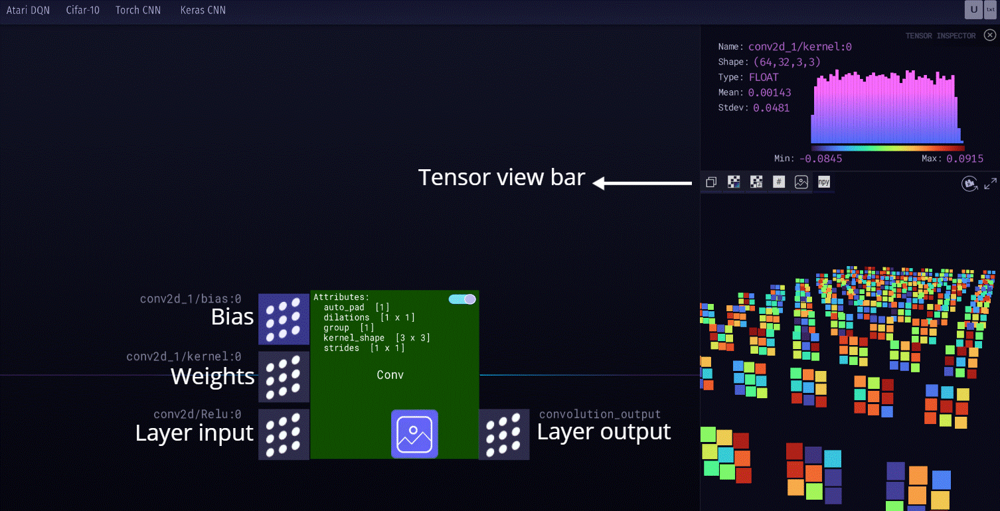

Statistics about the tensor value and its distribution is given in the histogram in the top panel. You can also see the tensor name and shape. The tensor and its values is represented in the middle panel and the bottom section contains tensor visualization parameters and a refresh button which allow the user to refresh the tensor. This is useful when the input or the weights are changing in real-time.
  

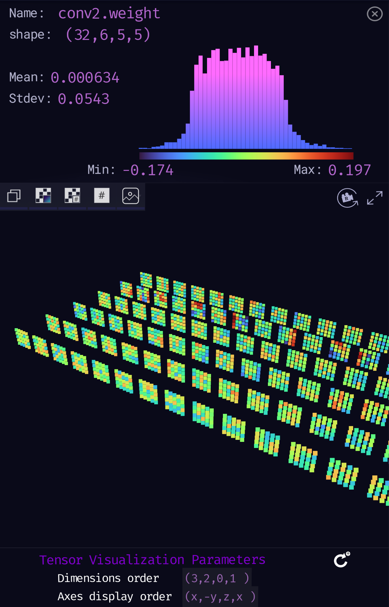

- ### Styles of tensor visualization
Tensors can be inspected in different ways, including 3D view and 2D view with and without actual values.
  

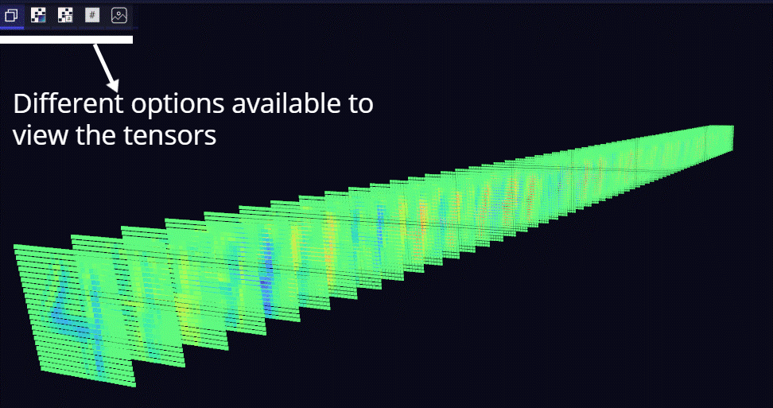
 

  

Tensor View | Screenshot
:---: | :---:
N-dimensional tensor projected in the 3D space | 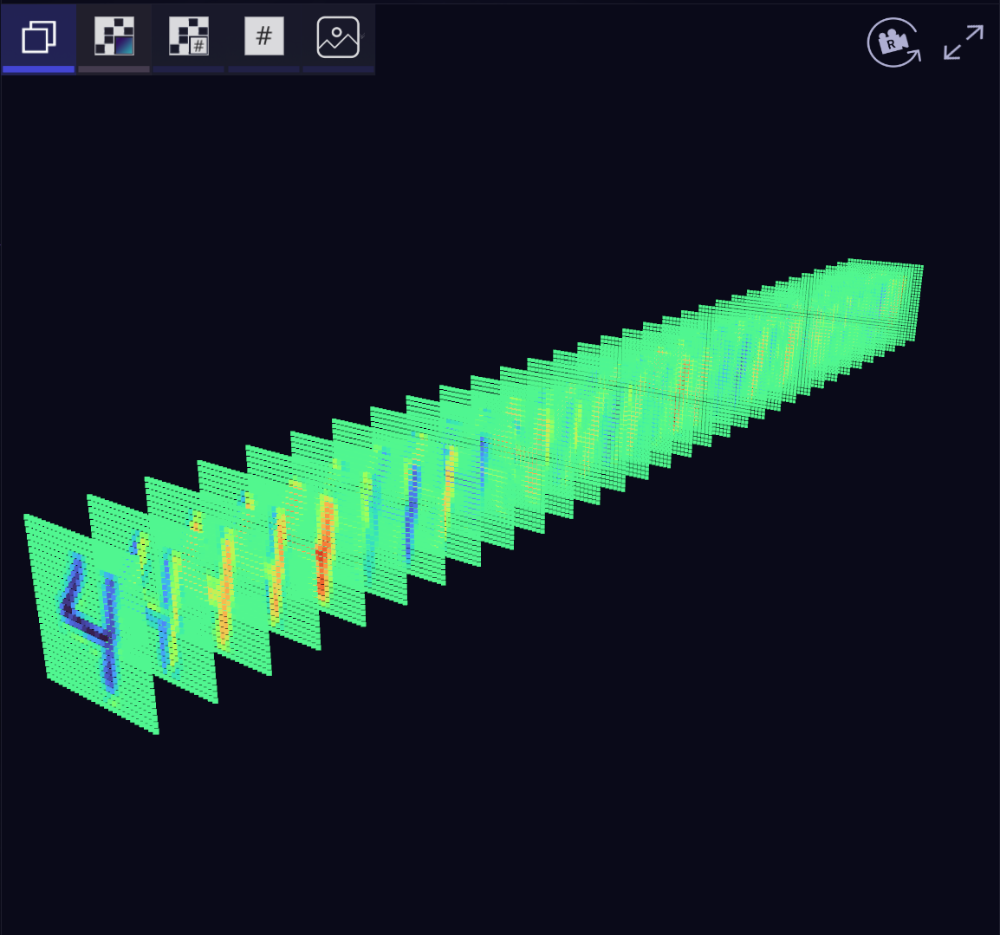  
N-dimensional tensor projected in the 2D space | 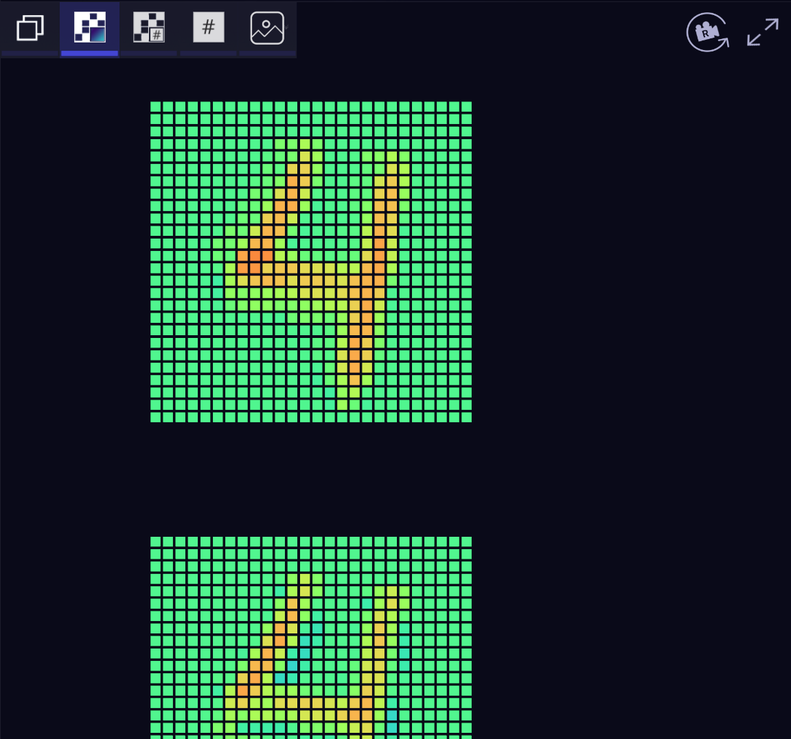
Tensor values and color representations of each value based on the gradient shown on the x-axis of the distribution histogram | 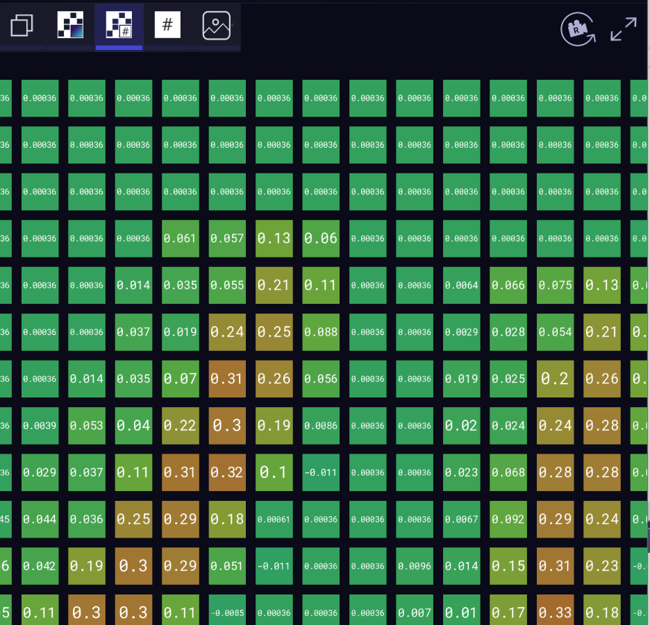
Tensor values__ | 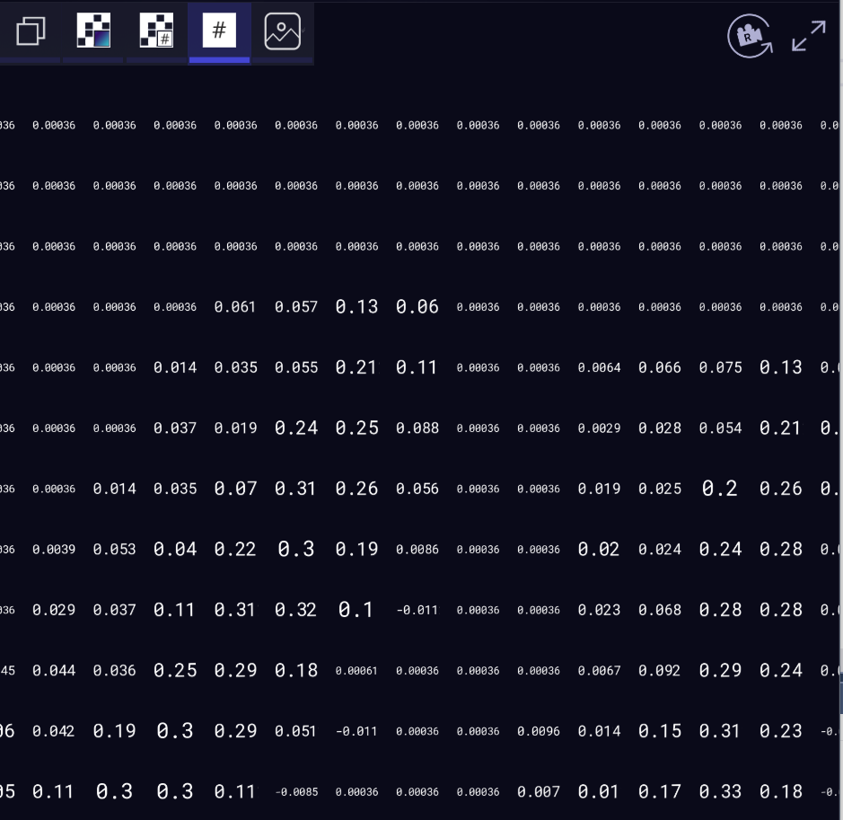
Feature maps view when the tensor has shape of dimension 3| 

- ### Synthetic Input
After loading an .ONNX, the internal weights and biases tensor can be accessed and viewed in the tensor side panel. After pressing the input and output tensor buttons, because the model did not receive an input, no tensor will be displayed.

By pressing the 'Load ONNX input' icon, a synthetic input will be created to match the size and shape of the input tensor. Then, the input is passed to the model which will generate all the internal tensors.
  
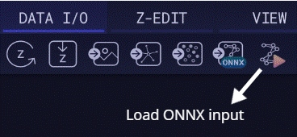

# **Models**
We have generated a few ZTN models for inspecting their architecture and internal tensors in the viewer. We have also provided the code used to generate these models.
## Image Classification
- [Alexnet](models/README.md#alexnet)
- [EfficientNet](models/README.md#efficientnet)
- [Resnet50v2](models/README.md#resnet50v2)
## Object Detection
- [YoloV3](models/README.md#yolov3)
- [SSD](models/README.md#ssd)
## Image Segmentation
- [Unet](models/README.md#unet)
## Body, Face and Gesture Analysis
- [Emotion_ferplus8](models/README.md#emotion_ferplus8)
- [RFB_320](models/README.md#rfb_320)
- [vgg_ilsvrc_16_age](models/README.md#vgg_ilsvrc_16_age)
- [vgg_ilsvrc_16_gen](models/README.md#vgg_ilsvrc_16_gen)
## Image Manipulation
- [Super resolution](models/README.md#super-resolution)
- [Style transfer](models/README.md#style-transfer)
## Machine Comprehension
- [RoBERTa](models/README.md#roberta)
## XAI
- [XAI for VGG16](models/README.md#xai-with-keras)
- [XAI for Alexnet](models/README.md#xai-with-pytorch)
## Classic Machine Learning
- [Sklearn Iris](models/README.md#sklearn-iris)

Please note that the python scripts for the models include the Zetane Engine Python-Zetane API functions as well. You may remove the Zetane API parts easily to run the script in Python if you don't have the Zetane Engine version.
***
# **Zetane Engine**
The Zetane Engine (30-day free trial) is an interactive workspace for debugging, understanding, and explaining data and neural networks. An important feature of the Zetane Engine not supported by the Zetane Viewer is the Python-Zetane API. Using the Python-Zetane API, you can send and visualize in the Zetane Engine multiple types of data coming from your own Python workflow (model, numpy, images, text, meshes).

## Installation
More information about the installation, Zetane Viewer, Zetane Engine 30-day free trial and sample examples is provided [here](https://docs.zetane.com/getting_started.html).
***
