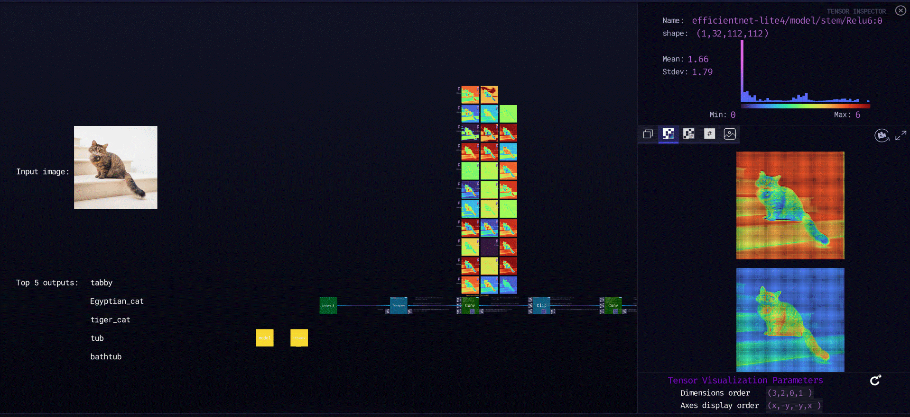
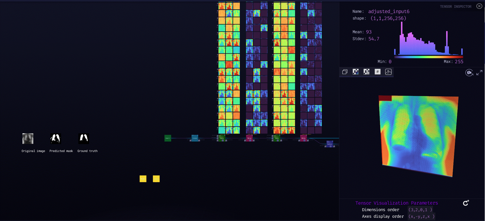
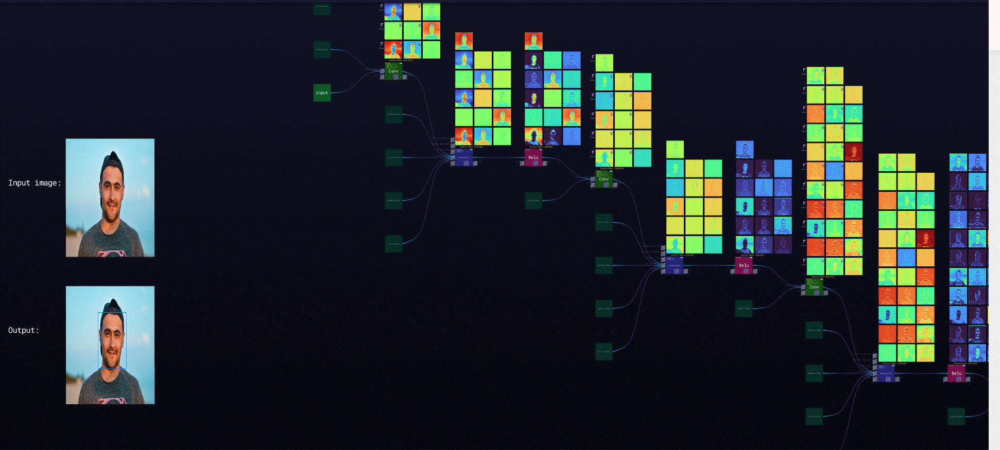
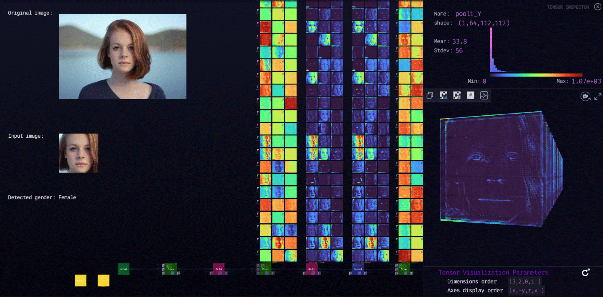

***

# **Super-resolution**

### Description

Super resolution is the process of upscaling and or improving the details within an image. Often a low resolution image is taken as an input and the same image is upscaled to a higher resolution, which is the output. The details in the high resolution output are filled in where the details are essentially unknown.
  
[ZTN model](super-resolution/ztn/super-resolution.ztn)

[ONNX model](super-resolution/super_resolution.onnx)

[Python script](super-resolution)
  

***

# **Alexnet**

### Description

Alexnet is a image classification model where the input is an image of one of 1000 different classes (e.g. cats, dogs etc.) and the output is a vector of 1000 numbers. The ith element of the output vector is interpreted as the probability that the input image belongs to the ith class. Therefore, the sum of all elements of the output vector is 1.The input to AlexNet is an RGB image of size 224x224. This means all images in the training set and all test images need to be of size 224x224.
  
[ZTN model](alexnet/ztn/alexnet.ztn)

[ONNX model](alexnet/alexnet.onnx)

[Python script](alexnet)
  

***

# **Efficientnet**

### Description

EfficientNet-Lite4 has been developed for image classification. It achieves high accuracy and is designed to run on mobile CPU (in addition to GPU, and TPU) where computational resources are limited. The input is an RBG image with the size of 224 x 224 x 3. Output of the model is an array score with the length of 1000.
  
[ZTN model](efficientnet/ztn/efficientnet.ztn)

[ONNX model](efficientnet/efficientnet-lite4-11.onnx)

[Python script](efficientnet)
  

***

# **Sklearn Iris**

### Description

This script used for classification of the iris dataset using RandomForestClassifier from sklearn. The data set contains 3 classes of 50 instances each, where each class refers to a type of iris plant. One class is linearly separable from the other, the latter are NOT linearly separable from each other.
  
[ZTN model](sklearn_iris/ztn/sklearn_iris.ztn)

[ONNX model](sklearn_iris/rf_iris.onnx)

[Python script](sklearn_iris)
  

***

# **Unet**

### Description

This model is used for segmentation of images (particularly medical images). It has a encoding/decoding structure, with some skip connections in between. The architecture is very strong in working with a small dataset and yields precise segmentations in a short time. The model is fully convolutional. In this script, the size of the input image is 256 x 256.
  
[ZTN model](unet/ztn/unet.ztn)

[ONNX model](unet/unet.onnx)

[Python script](unet)
  

***

# **Resnet50v2**

### Description

ResNet50 is a convolutional neural network with 50 layers. Deep neural networks are difficult to train, and residual blocks facilitate the training of substantially deep networks and make the optimization easier and increase the accuracy. This model benefits from residual blocks and is used for image classification. The input is an image (224 x 224 x 3), and the output is an array of length 1000. The network is trained on Imagenet.
  
[ZTN model](resnet50v2/ztn/resnet50v2.ztn)

[ONNX model](resnet50v2/resnet50-v2-7.onnx)

[Python script](resnet50v2)
  

***

# **Emotion_ferplus8**

### Description

This model is used for emotion recognition in faces. Facial expression recognition is done with crowd-courced label distribution. The model expects input of the shape 64 x 64. The model outputs an array of 8 scores corresponding to the 8 emotion classes:
emotion_table = ['neutral':0, 'happiness':1, 'surprise':2, 'sadness':3, 'anger':4, 'disgust':5, 'fear':6, 'contempt':7]
  
[ZTN model](emotion_ferplus8/ztn/emotion_ferplus8.ztn)

[ONNX model](emotion_ferplus8/emotion-ferplus-8.onnx)

[Python script](emotion_ferplus8)
  

***

# **STYLE TRANSFER**

### Description

Neural style transfer is an optimization technique used to take two images, a content image and a style reference image (such as an artwork by a famous painter) and blend them together so the output image looks like the content image, but painted in the style of the style reference image. This is implemented by optimizing the output image to match the content statistics of the content image and the style reference image. These statistics are extracted from the images using a convolutional network.
  
[ZTN model](style_transfer/ztn/style_transfer.ztn)

[ONNX models](style_transfer)

[Python script](style_transfer)
  

***

# **YoloV3**

### Description

Object detection is a computer vision task that involves predicting the presence of one or more objects, along with their classes and bounding boxes.YOLO (You Only Look Once) is a state of art Object Detector which can perform object detection in real-time with a good accuracy.YOLOv3 is a real-time, single-stage object detection model that builds on YOLOv2 with several improvements. Improvements include the use of a new backbone network, Darknet-53 that utilises residual connections.This model detects 80 different classes.
  
[ZTN model](yolo_V3/ztn/yolo_V3.ztn)

[ONNX model](yolo_V3/yolo_v3.onnx)

[Python script](yolo_V3)
  

***

# **SSD**

### Description

SSD is a single-shot detector. It has no delegated region proposal network and predicts the boundary boxes and the classes directly from feature maps in one single pass.To improve accuracy, SSD introduces a small convolutional filters to predict object classes and offsets to default boundary boxes, separate filters for default boxes to handle the difference in aspect ratios and multi-scale feature maps for object detection.SSD can be trained end-to-end for better accuracy. SSD makes more predictions and has a better coverage on location, scale and aspect ratios. With the improvements above, SSD can lower the input image resolution to 300 × 300 with a comparative accuracy performance. By removing the delegated region proposal and using lower resolution images, the model can run at real-time speed and still beats the accuracy of the state-of-the-art Faster R-CNN.
  
[ZTN model](ssd/ztn/ssd.ztn)

[ONNX model](ssd/ssd-10.onnx)

[Python script](ssd)
  

***

# **XAI with Keras**

### Description

This snapshot uses the VGG16 architecture with the Zetane XAI API to produce explainability visualizations. Currently, our API can visualize the following algorithms for Keras models: Vanilla Backpropagation, Guided Backpropagation, Integrated Gradients, SmoothGrad, Grad x Image, Grad-CAM, Guided Grad-CAM, Occlusion Sensitivity, LIME.

**Framework:** TensorFlow

  
[ZTN model](xai_keras/ztn/xai_keras.ztn)

[Python script](xai_keras)
  

***

# **XAI with PyTorch**

### Description

This snapshot builds on the AlexNet example, using the Zetane XAI API to produce explainability visualizations for the model. Currently, our API can visualize the following algorithms: Vanilla Backpropagation, Guided Backpropagation, Integrated Gradients, SmoothGrad, Grad x Image, Grad-CAM, Guided Grad-CAM, LIME.

**Framework:** PyTorch

  
[ZTN model](xai_torch/ztn/xai_torch.ztn)

[Python script](xai_torch)
  

***

# **RFB_320**

### Description

This model is designed for face detection in real time. This lightweight model is developed specifically for edge computing devices, and smartphones. Input tensor is a color image of size 1 x 3 x height x width with mean values of 127, 127, 127. Input images should be in the RGB format and resized to 320 x 240 pixels for this version of the model. The model outputs two arrays for scores (1 x 4420 x 2) and boxes (1 x 4420 x 4).
  
[ZTN model](RFB_320/ztn/RFB_320.ztn)

[ONNX model](RFB_320/version-RFB-320.onnx)

[Python script](RFB_320)
  

***

# **vgg_ilsvrc_16_age**

### Description

This model is an improved version of the 16-layer VGG model. It has been used by the VGG team in the ILSVRC-2014 competition, where it ranked the second place in the classification task. The input is an image of size 224 x 224 (BGR format), and the output is a vector of length 101 showing the scores. The output age is the expected value of the ages 0-101.
  
[ZTN model](vgg_ilsvrc_16_age/ztn/vgg_ilsvrc_16_age.ztn)

[ONNX model](vgg_ilsvrc_16_age/vgg_ilsvrc_16_age_imdb_wiki.onnx)

[Python script](vgg_ilsvrc_16_age)
  

***

# **vgg_ilsvrc_16_gen**

### Description

This model is an improved version of the 16-layer VGG model. It has been used by the VGG team in the ILSVRC-2014 competition, where it ranked the second place in the classification task. The input is an image of size 224 x 224 (BGR format), and the output is a vector of length 2 showing the probability of being male and female.  
  
[ZTN model](vgg_ilsvrc_16_gen/ztn/vgg_ilsvrc_16_gen.ztn)

[ONNX model](vgg_ilsvrc_16_gen/vgg_ilsvrc_16_gender_imdb_wiki.onnx)

[Python script](vgg_ilsvrc_16_gen)

  

