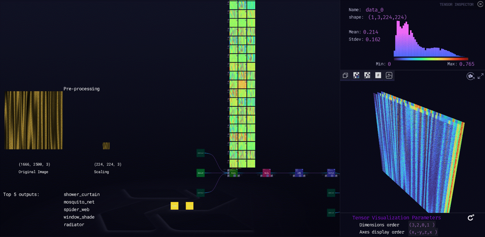

***

# **Alexnet**

### Description

Alexnet is a image classification model where the input is an image of one of 1000 different classes (e.g. cats, dogs etc.) and the output is a vector of 1000 numbers. The ith element of the output vector is interpreted as the probability that the input image belongs to the ith class. Therefore, the sum of all elements of the output vector is 1.The input to AlexNet is an RGB image of size 224x224. This means all images in the training set and all test images need to be of size 224x224.
  
[ZTN model](ztn/alexnet.ztn)

[ONNX model](alexnet.onnx)

[Python script](alexnet.py)
  
