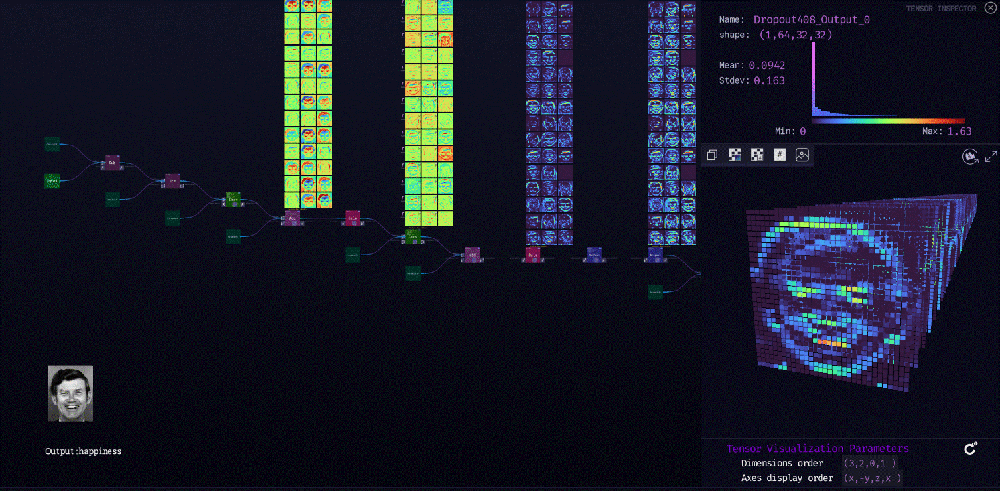

***

# **Emotion_ferplus8**

### Description

This model is used for emotion recognition in faces. Facial expression recognition is done with crowd-courced label distribution. The model expects input of the shape 64 x 64. The model outputs an array of 8 scores corresponding to the 8 emotion classes:
emotion_table = ['neutral':0, 'happiness':1, 'surprise':2, 'sadness':3, 'anger':4, 'disgust':5, 'fear':6, 'contempt':7]
  
[ZTN model](ztn/emotion_ferplus8.ztn)

[ONNX model](emotion-ferplus-8.onnx)

[Python script](emotion_ferplus8.py)
  
