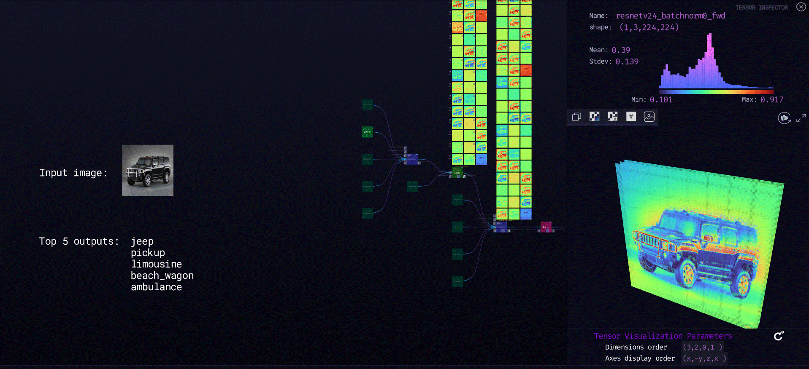

***

# **Resnet50v2**

### Description

ResNet50 is a convolutional neural network with 50 layers. Deep neural networks are difficult to train, and residual blocks facilitate the training of substantially deep networks and make the optimization easier and increase the accuracy. This model benefits from residual blocks and is used for image classification. The input is an image (224 x 224 x 3), and the output is an array of length 1000. The network is trained on Imagenet.
  
[ZTN model](ztn/resnet50v2.ztn)

[ONNX model](resnet50-v2-7.onnx)

[Python script](resnet50v2.py)
  
