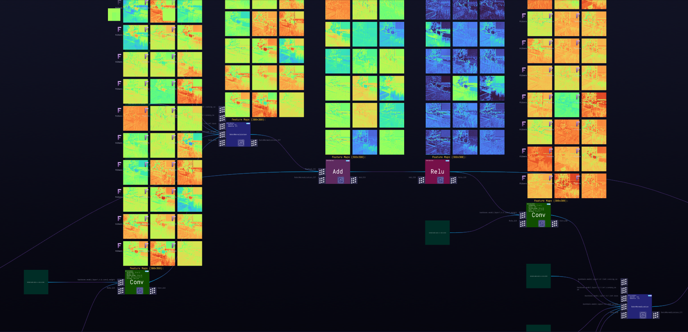

***

# **SSD**

### Description

SSD is a single-shot detector. It has no delegated region proposal network and predicts the boundary boxes and the classes directly from feature maps in one single pass.To improve accuracy, SSD introduces a small convolutional filters to predict object classes and offsets to default boundary boxes, separate filters for default boxes to handle the difference in aspect ratios and multi-scale feature maps for object detection.SSD can be trained end-to-end for better accuracy. SSD makes more predictions and has a better coverage on location, scale and aspect ratios. With the improvements above, SSD can lower the input image resolution to 300 × 300 with a comparative accuracy performance. By removing the delegated region proposal and using lower resolution images, the model can run at real-time speed and still beats the accuracy of the state-of-the-art Faster R-CNN.
  
[ZTN model](ztn/ssd.ztn)

[ONNX model](ssd-10.onnx)

[Python script](ssd.py)
  
