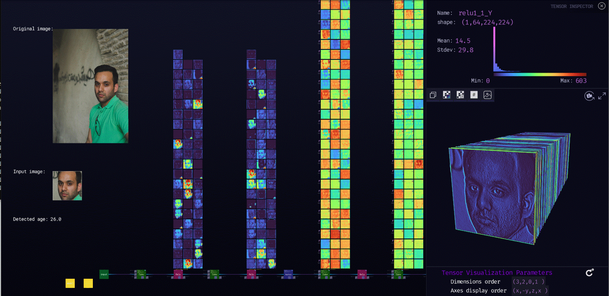

***

# **vgg_ilsvrc_16_age**

### Description

This model is an improved version of the 16-layer VGG model. It has been used by the VGG team in the ILSVRC-2014 competition, where it ranked the second place in the classification task. The input is an image of size 224 x 224 (BGR format), and the output is a vector of length 101 showing the scores. The output age is the expected value of the ages 0-101.
  
[ZTN model](ztn/vgg_ilsvrc_16_age.ztn)

[ONNX model](vgg_ilsvrc_16_age_imdb_wiki.onnx)

[Python script](vgg_ilsvrc_16_age.py)
  
