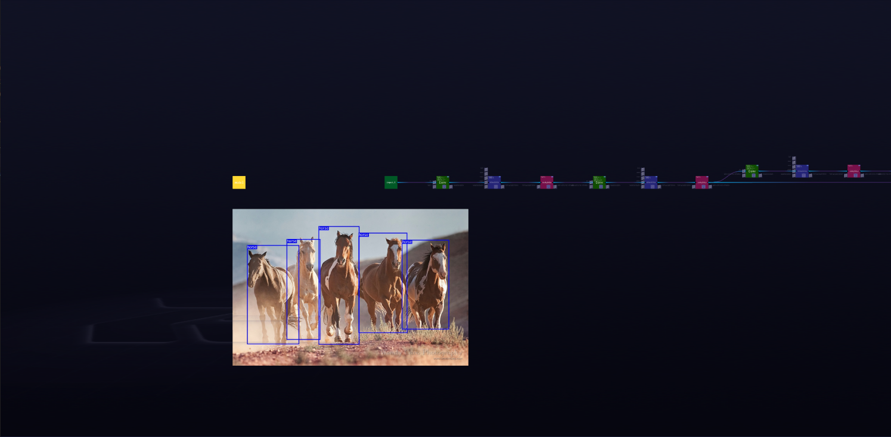

***

# **YoloV3**

### Description

Object detection is a computer vision task that involves predicting the presence of one or more objects, along with their classes and bounding boxes.YOLO (You Only Look Once) is a state of art Object Detector which can perform object detection in real-time with a good accuracy.YOLOv3 is a real-time, single-stage object detection model that builds on YOLOv2 with several improvements. Improvements include the use of a new backbone network, Darknet-53 that utilises residual connections.This model detects 80 different classes.
  
[ZTN model](ztn/yolo_V3.ztn)

[ONNX model](yolo_v3.onnx)

[Python script](yolo_V3.py)
  
